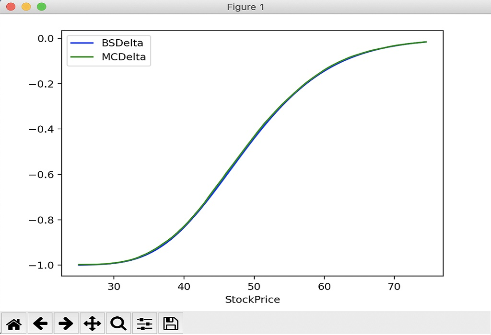

# BASIC OPTION PRICING

The objective of this project was to explore the use of numpy, pandas, scipy and matplotlib
to price European Options using the Black Scholes analysis and Monte Carlo Methods.

Originally this code was written using Anaconda, however I decided to change the setup so that
it was independent of Anaconda and used a local virtual environment in the directory which is setup using
a requirements.txt file.

I used a relatively new version of python - version 3.7.

Analytics libraries can grow to be huge.   This one is very basic and is used only to explore the use of numpy.   I have not created
a binomial tree, volsurface, borrow curve, dividends etc.   It is also worth noting that the Gamma calculation has a discontinuity
at the strike price (imagine differentiating the intrinsic value of an option twice), which becomes noticable in the Gamma graphs.

As time progresses, I may add to this library, but this will only be on an ad-hoc basis because my main objective of trying out numpy
and matplotlib has been met.

This program uses a matrix of stock prices adjusted using a matrix of random numbers to generate a monte carlo price of an option, so 
this application could be memory intensive.   I am running this on a macbook pro with 2.8 GHz and 16 GB of memory.

The code has over 90% coverage and has been checked with pycodestyle.

A docs directory has been created which I suggest you look at, but the key parts are shown below:



## INSTALLATION

---

I have a makefile setup which can simplify installing and running this application, but if you want to use a manual
installation please follow these instructions:

* Firstly, remove the 'venv' virtual environment if it exists in the directory:
    * Mac:
    ```
    rm -rf venv (mac)
    ```
    * Windows:
    ```
    rmdir venv /s (windows)
    ```


* Recreate the virtual environment:
    * Mac:
    ```
    python3.7 -m venv venv
    deactivate or source deactivate
    source venv/bin/activate
    pip install -r requirements.txt
    ```
    * Windows:
    ```
    python3.7 -m venv venv
    deactivate or source deactivate
    .\venv\Scripts\activate
    pip install -r requirements.txt
    ```

* You man need to install the app manually
    ```
    pip install -e .
    ```

## RUNNING THE APPLICATION

---

* Firstly, ensure the virtual environment is activated:
    * Mac:
    ```
    deactivate or source deactivate
    source venv/bin/activate
    ```
    * Windows:
    ```
    deactivate or source deactivate
    .\venv\Scripts\activate
    ```

* Then try out the scripts in the run directory, eg:
    ```
    python3.7 ./run/run_0_BlackScholesvsIntrinsic.py
    python3.7 ./run/run_1_BlackScholesvsMonteCarlo.py
    etc
    ```

## UNITTEST's

---

Unittests are very important when writing a pricing module because it can ensure that the price generated is rational.

Because we are quite often comparing calculated results against a result based upon random numbers, there was a chance that the unit tests could fail.   For this reason I allowed a large margin of error based upon the standard deviation when comparing option prices to their monte carlo prices.   At a later point in time I decided to create a unit test that uses 'patch object' to fix the random numbers generated.   This should 'fix'
the unit test price result.   Both set of tests have been left in so that you could choose which style to use.   Using 'patch object' would
probably be safer to ensure the price generated in the test is always consistent.

## MAKEFILE

---

I have created a makefile that can simplify running commands.   I suggest you take a look at the makefile and if you want to see a list of the commands, try the following:

```
make
```
or
```
make help
```
